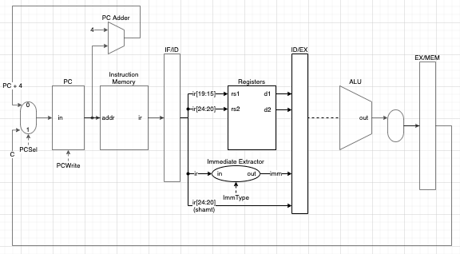

# Instruction Decode Phase-related Module

## Block Diagram

<figure>
    
    <figcaption></figcaption>
</figure>

## Registers Module
### Inputs
- `rs1`: index of first register
- `rs2`: index of second register
### Outputs
- `d1`: value of register at index `rs1`
- `d2`: value of register at index `rs2`

## Immediate Extractor Module
### Inputs
- `in`: instruction (32-bits)

### Outputs
- `out`: sign extended immediate value (32-bits)

### Control Bits
- ImmType: determine the way to extract immediate from the instruction
  - 000: I_imm
  - 001: B_imm
  - 010: S_imm
  - 011: U_imm
  - 100: J_imm

### Calculations
```
I_imm = sext(in[31:20])
B_imm = sext({ IR[31], IR[7], IR[30:25], IR[11:8], 0 })
S_imm = sext({ IR[31:25], IR[11:7] })
U_imm = sext(IR[31:12] << 12)
J_imm = sext({ IR[31], IR[19:12], IR[20], IR[30:21], 0 })
```

> NOTE: might need to update Instruction Execution Table based on this block diagram
