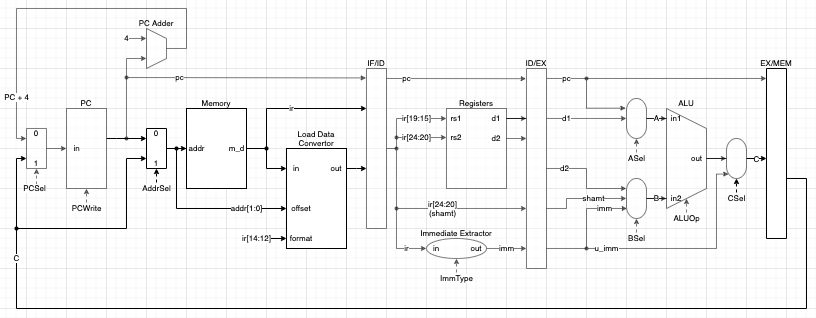

# Memory Access Phase-related Modules

## Block Diagram

<figure>
    
    <figcaption></figcaption>
</figure>

## Addr-Multiplexer (Addr-Mux)
### Inputs
- `pc`
- `C`
  
### Outputs
- `addr`: input to Memory Module

### Control Bits
- `AddrSel`: determine which value to pass on to `addr`.
  - 0: `pc`
  - 1: `C`

## Memory Module (will be provided?)
> NOTE: wait for actual module

## Load Data Convertor Module
### Inputs
- `in`: data read from memory.
- `offset`: `in` from memory contains four bytes so `offset` will determine which byte in `in` to extract (`offset` can be known from the smaller 2 bits of memory address).
- `format`: determine how to extract and extend `in` (value of `format` can be get from funct3 of B-Type instruction `ir[14:12]`).

### Outputs
- `out`: signed / unsigned extended value of data extracted from `in`.
