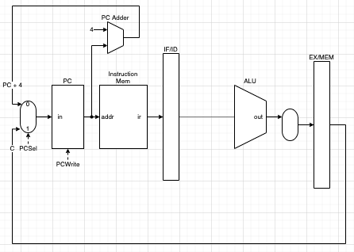

# Program Counter Module

## I/O
### Inputs
- `in`: value of next PC

### Outputs
- `pc`: address to current instruction in instruction memory.

## Block Diagram

<figure>
    
    <figcaption></figcaption>
</figure>

## Program Counter Controller Module
### Control Bits
- PCSel
  - decide which value (input) to pass on to `in` of PC.
    - 0: PC + 4 (default)
    - 1: C
- PCWrite
  - decide whether to update value of PC with `in`.
    - 0: NOT ok (default)
    - 1: OK
  - PC will only be updated on the following phases.
    - `IF`: 
      - update after an instruction is fetched.
    - `WB`:
      - update PC if current instruction is jump instruction.
      - update PC if current instruction is branch intruction and branch condition is met.
